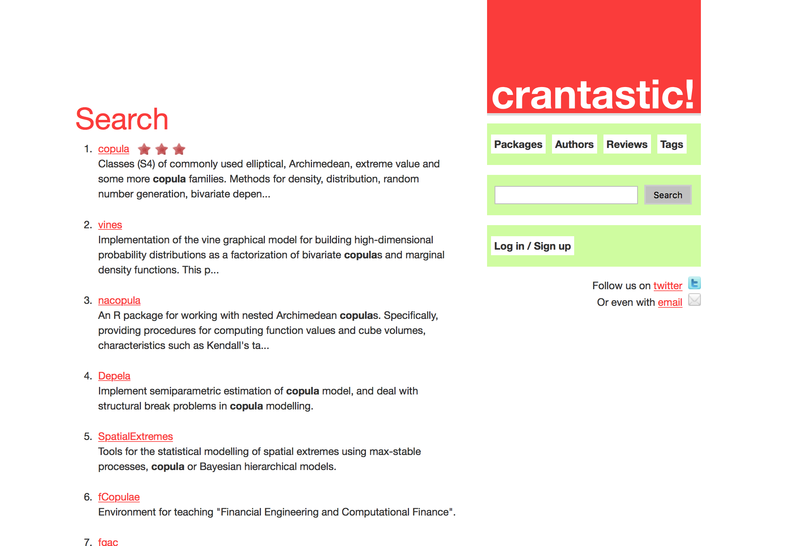

=============
Rでcopula
=============

Packages
--------------

copulaを推定するためのRパッケージ、いろいろあります。
* GOFcopula
* copulaGOF
* copula
* VineCopula

copulaをダウンロード
+++++++++++++++++++++

スライドで紹介されていたcopulaGOFが見つからなかったので、copulaをダウンロードしました。 ::

	install.package("copula")
	
What is copula?
+++++++++++++++++++++

二つ以上の周辺化確率分布からJoint probability distributionを出力する関数。KendallやSpearmanの順位相関検定などと深い関わりがある。
ガウシアンやStudent、アルキメディアンコピュラなどにフィッティングすることで、多変量の確率分布から同時確率分布をモデル化できる。

j
